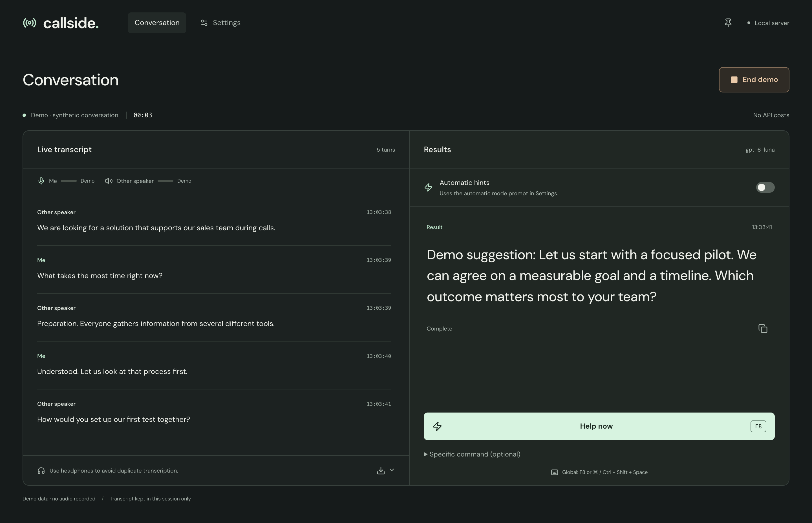

# Callside

**Live AI assistance for meetings, sales calls, interviews, and workshops. No typing required during the conversation.**

Callside is an MIT-licensed desktop call copilot. It transcribes microphone and call audio, uses your task instructions and reference material, and streams contextual suggestions. Press **F8**, click **Help now**, or enable **Automatic hints** so the model decides when to offer help. Questions and commands are optional.

It is a free, open-source alternative to Cluely for live conversation assistance. See the [comparison section](#an-alternative-to-cluely-final-round-ai-and-lockedin-ai) for differences and limitations.

**The software is free.** There is no Callside subscription, license fee, or account requirement. Local transcription and local speaker labeling need no API key. Suggestions can use an eligible ChatGPT plan or paid OpenAI API credit; optional cloud transcription and cloud speaker attribution incur separate API charges. The built-in demo needs no account or API key.

[Quick start](#quick-start) · [Compare alternatives](docs/ALTERNATIVES.md) · [Contributing](CONTRIBUTING.md) · [Roadmap](docs/ROADMAP.md) · [MIT license](LICENSE) · [Third-party notices](docs/THIRD_PARTY.md)



## macOS installer

[Download Callside 0.7.0 for Apple Silicon](https://github.com/Eslsamu/callside/releases/download/v0.7.0/Callside-0.7.0-mac-arm64.dmg) · [Release notes and SHA-256 checksum](https://github.com/Eslsamu/callside/releases/tag/v0.7.0)

Requires **macOS 14 or later on an Apple Silicon Mac (M1 or newer)**. Intel Macs,
Windows, and Linux do not have a validated installer in this release.

This is a **community build, not notarized by Apple**. macOS may block its first
launch. Download only from this repository, drag Callside into Applications,
and follow the [installation and first-launch instructions](docs/macos-installer.md).
An Apple Developer membership is not required to use the app.

The app includes the local audio runtimes. In **Settings → Audio**, use
**Prepare local audio** before your first call. Initial downloads require
internet and disk space; no Homebrew, Xcode, Python, or Node installation is needed.
Suggestions still require an eligible ChatGPT plan or an OpenAI API key.
Community builds use manual updates; replace the app in Applications with a newer
release while retaining its saved settings and models.

## How it works without typing

1. **Before the call:** choose a task and model, add course notes, product facts, or other reference material, and select audio sources.
2. **During the call:** Callside transcribes the conversation. Press **F8** or **Command/Ctrl+Shift+Space** for a contextual response, explanation, next step, or other configured output. You do not have to retype what someone said.
3. **For automatic help:** enable **Automatic hints** and set a rule, such as “When a participant needs clarification, suggest a short explanation using the course notes.” Checks follow finalized speech segments and can return no suggestion.

The model infers the current need from the available transcript and instructions. Automatic timing and answer quality are model-dependent. The desktop shortcuts work outside the Callside window when the operating system allows registration; the browser shortcut requires focus.

## An alternative to Cluely, Final Round AI, and LockedIn AI

If you are looking for a **free, open-source Cluely alternative**, Callside provides live transcription and contextual assistance with source code you can modify and an API key you control. It also covers the live conversation-assistance use case of tools such as **Final Round AI** and **LockedIn AI**, while allowing tasks for teaching, customer support, and sales.

The [comparison guide](docs/ALTERNATIVES.md) links to those products' official documentation and explains the differences. Callside is an independent project; it does not claim feature parity, guaranteed latency, screen understanding, or invisibility during screen sharing.

## Project status

Early-stage software. The code is MIT-licensed. macOS Apple Silicon has been used for desktop testing. Windows and Linux packaging targets exist, but their capture paths need broader real-device testing. A non-notarized Apple Silicon community installer is available above; build from source with the commands below for development.

## What it does

- Live transcript with separate labels for your microphone and the other side of the call.
- Background speaker attribution for the call channel while live text and suggestions continue.
- **Help now** and **F8** use the current conversation without a typed question; an optional command field is available.
- Desktop shortcuts **F8** and **⌘⇧Space** on macOS or **Ctrl+Shift+Space** on Windows/Linux, which also work while the desktop app is in the background when the OS allows registration.
- Automatic hints: give the assistant a rule such as “suggest an answer whenever the customer asks a question.” The model can choose to stay quiet.
- Configurable answer model, prompts, language, source labels, and meeting context.
- JSON and Markdown exports. Session contents stay in memory until you export them.
- A clearly marked demo that works without a microphone or API key.

## Run it

Use **Node.js 22.12 or later** and npm.

```sh
git clone https://github.com/Eslsamu/callside.git
cd callside
npm ci
npm run dev
```

Open the local address printed in the terminal. Choose the demo to try the complete transcript and suggestion flow without an account.

For a real call, transcription defaults to **Local · Whisper** and needs no API key.
Install whisper.cpp first (`brew install whisper-cpp` on macOS); the first start
downloads the 574 MB large-v3-turbo Q5 model. Desktop builds store models in their
application data folder. Other platforms can set `WHISPER_SERVER_BIN` and
`WHISPER_MODEL_PATH` to a compatible whisper.cpp server and model.

For audio processing without API charges, install the local speaker runtime on
Apple Silicon (macOS 14+, Xcode/Swift required):

```sh
npm run local:speakers:setup
```

In **Settings → Audio**, choose **Use local audio + ChatGPT subscription**,
then connect your ChatGPT account in settings. This selects local Whisper,
local LS-EEND speaker labeling, and subscription suggestions. Model weights
download on first use. There is no automatic cloud or API-billing fallback.

**Speaker labeling** has three independent choices:

- **Off:** microphone / other speaker only.
- **Local · LS-EEND (experimental):** CPU processing with up to four remote voices.
  Labels arrive in the background without delaying suggestions. Ambiguous turns
  remain unassigned or show multiple speakers. This is not verified identity recognition.
- **OpenAI:** sends call audio to gpt-4o-transcribe-diarize and incurs API charges.

Normal source setup for local speaker labeling currently supports Apple Silicon Macs.
An experimental Windows preview bundles a portable CPU runtime; it still needs real-device
validation. See [Windows testing](docs/windows-testing.md). Other source setups can
turn speaker labeling off or select OpenAI. Build the runtime before packaging a macOS release;
the executable and its FluidAudio license are included in the desktop package.
FluidAudio is pinned in the native Swift package and uses the Apache 2.0 license.

Suggestions send transcript/context text to your selected provider. ChatGPT plan
limits still apply; local audio does not make answer generation offline. Headphone-free
microphone echo can still cause duplicate text or incorrect attribution.

For OpenAI features, enter an [OpenAI Platform API key](https://platform.openai.com/api-keys) in the app settings. Alternatively, copy `.env.example` to `.env` and set `OPENAI_API_KEY` there. `.env` is ignored by Git. Restart the server after changing environment variables.

To use the desktop window and global shortcut:

```sh
npm run desktop
```

To run the production web build:

```sh
npm run build
npm start
```

### Quick start

1. Run `npm ci` and `npm run dev`, then open the local address shown.
2. Select **Try demo**, or install whisper.cpp for local calls. Add an OpenAI API key only for cloud audio features or API-billed suggestions.
   In the desktop app, leave **Remember API key on this device** checked and click **Save API key** to reuse it after restarting. **Remove API key** clears the saved key and the current session key. Browser users can set `OPENAI_API_KEY` in a local `.env` file.
3. Choose your model, prompts, context, microphone, and call audio.
4. Let everyone know about transcription, then start the call and grant audio permissions.
5. Press **F8** or click **Help now**; no typed command is needed. Enable **Automatic hints** for prompt-controlled assistance.
6. End the call and export the session as JSON or Markdown if needed.

## ChatGPT subscription or API key?

The desktop app supports **Continue with ChatGPT** for contextual suggestions using OpenAI's [official ChatGPT plan usage flow](https://developers.openai.com/siwc/token-sharing-open-source). There is no extra Callside subscription. Plan eligibility, available models, and usage limits are controlled by OpenAI. Transcription and speaker attribution still require an API key and incur API charges.

1. Open **Settings → Suggestion connection → Continue with ChatGPT**.
2. Complete sign-in and approve plan usage in your system browser, then return to Callside.
3. Select **ChatGPT subscription** and an available GPT-6 model. Click **Save template** to retain this billing choice and your task settings after restarting.
4. Keep your existing API key for audio. Use **Help now**, F8, or **Automatic hints** as before; no typing is required.

Credentials are encrypted using the OS key store and refreshed automatically. You can switch accounts, reconnect, sign out, and open ChatGPT usage settings. Tokens are never saved in templates or exports. Subscription errors **never fall back to API billing**. The browser-only version currently supports API keys only.

In subscription mode, custom output caps and explicit cache controls are omitted. Fast mode requests priority processing where the account allows it. OpenAI documents 2.5× included subscription usage for Fast mode and 2× purchased-credit usage; see [subscription speed and usage](https://learn.chatgpt.com/docs/agent-configuration/speed). Reasoning strength, reference material, streamed suggestions, and automatic triggers remain available. Account-specific GPT-6 model availability comes from OpenAI; a subscription does not guarantee access to every model. The built-in demo stays synthetic and does not test your subscription connection.

New settings default to local Whisper transcription, experimental local LS-EEND speaker labeling, and `gpt-6-luna` with no reasoning for tasks. API billing is initially selected for suggestions; connect ChatGPT and choose subscription billing to use your plan. When you select cloud audio, the models are `gpt-live-transcribe` for live transcription and `gpt-4o-transcribe-diarize` for diarization. Access depends on your API project. Task models are restricted to GPT-6 Luna, GPT-6 Sol, GPT-6.1 Sol, and GPT-6 Astra. Reasoning strength is configurable: None, Low, Medium, High, Extra high, or Maximum; Astra and GPT-6.1 Sol start at Low. Fast mode requests priority processing where available at 2× standard token rates. It is off by default. The output budget includes both reasoning and visible answer tokens. Check [OpenAI API pricing](https://developers.openai.com/api/docs/pricing) and your project limits before a long call. Automatic mode can make repeated model requests, including requests whose result is silence.

## Choosing an audio mode

| Mode                                     | Speaker labels                                                  | Tradeoff                                                                  |
| ---------------------------------------- | --------------------------------------------------------------- | ------------------------------------------------------------------------- |
| Local Whisper + local speakers (default) | Experimental LS-EEND labels arrive in the background.           | Local model/runtime setup required; audio stays on the computer.          |
| Live transcription + speakers off        | Microphone and system audio have separate source labels.        | All remote participants share the call-audio label.                       |
| Live transcription + OpenAI speakers     | Background labels linked using temporary voice reference clips. | Sends call audio to OpenAI and adds API charges.                          |
| OpenAI speaker diarization               | Transcription and labels returned in short audio blocks.        | Adds buffering and request latency; identities may change between blocks. |

Transcription and background speaker labeling are independent settings. Local and
OpenAI background results update existing turns without delaying suggestions or
adding a duplicate transcript. Recent speech can remain pending. Corrected labels
are used by subsequent answers and exports. Local labels are experimental; they
do not establish a participant's real identity.

When **OpenAI** background labeling is selected, call audio is analyzed in
12-second batches with up to two seconds of overlap. Existing saved batch lengths
are retained. The following reference-clip behavior applies to OpenAI labeling:

Clean, non-overlapping voice clips of 2–6 seconds are kept in capture memory for up to four remote speakers and sent as OpenAI known-speaker references in later requests. This links generic Speaker 1–4 labels between batches, but is not a guarantee of identity. Short or overlapping voices without a clean clip, and additional voices beyond the reference limit, remain visibly scoped to their batch. Reference clips are cleared at the end of capture and excluded from templates and exports. Callside does not infer real names or enroll permanent voiceprints.

The status line shows processing time after a result, excluding the time spent collecting the batch. When background analysis cannot keep up, it skips older pending batches. If it fails, it pauses attribution while live transcription continues. Some turns may remain unattributed. End call drains final work for at most ten seconds for background attribution. Disable the background checkbox to avoid its extra API usage; the overlap also adds a small amount of repeated audio analysis.

Overlapping speech, echo, and poor audio can reduce accuracy. Use headphones to avoid feeding the remote speaker back through your microphone. Speaker attribution on the call channel does not remove acoustic microphone bleed.

**Filter microphone echo duplicates** is enabled by default. When near-identical speech starts on both channels within 750 ms, the transcript keeps the finalized call-channel copy. Numbers and negations must agree; short replies and later repetitions remain. Blank transcript turns are omitted. This text filter does not prevent duplicate audio from being transcribed or reduce transcription billing. Disable it to compare the original channel entries in the current session. It is a heuristic and can misclassify simultaneous repetition; headphones still give the cleanest separation.

In browser mode, choose a shareable tab or surface and enable its audio-sharing option. Support for full system audio depends on the browser and OS. The desktop app provides an additional Electron capture path. If your call's audio cannot be shared, use **Load audio inputs** and select a virtual loopback device under **Call audio source**. This keeps remote audio on the call channel used by automatic hints. See [audio setup and troubleshooting](docs/TROUBLESHOOTING.md).

## Configure a task and reference material

Put behavior in **Task instructions** and course notes, documentation, or other facts in **Reference material**. The application supports explanations, hints, corrections, summaries, and typed commands. Choose a named template in **Settings → Templates & task → Saved templates**. Each template has independent settings, instructions, and reference material. General, Sales, Interview, and Workshop start with separate empty reference material. Your previous saved configuration migrates as **Saved setup**. Switching retains unsaved field edits for this app session; click **Save template** to persist the selected template and reopen it next time. Enter a unique name and use **Save as new** to create a copy. **Rename** changes only the name; **Delete template** asks for confirmation. Templates never contain API keys, ChatGPT credentials, or transcripts. Exact old default prompts migrate to general task instructions; custom saved instructions and existing numeric output budgets are preserved.

Reference material supports up to **100,000 characters**. The UI shows the count and retains oversized pasted text, but blocks task requests until it is shortened. The entire reference material is included with every request. Conversation history is a separate rolling window: the newest 120 transcript entries, bounded to 24,000 text characters. Callside does not retain the full workshop history in each model request.

### Workshop setup

1. Open **Settings** and choose **Workshop** under **Saved templates**.
2. Paste the course notes into **Reference material**. Include section names, exercise identifiers, and official solutions where available.
3. Choose **GPT-6.1 Sol**, **Low** reasoning, and **Model default** under **Output token limit**. Fast mode is optional and costs more.
4. Click **Save template**, return to **Conversation**, and leave **Automatic hints** off for the first test.
5. Press **F8**, **Command/Ctrl+Shift+Space**, or **Help now** whenever you need help. The model infers the current topic and need from the conversation; typing is optional and hidden under **Specific command (optional)**.

Manual triggering can use partial transcript text and works with reference material before anyone has spoken. Workshop instructions choose a response, explanation, example, exercise step, correction, or transition from the ongoing discussion. They lead with a short passage the facilitator can say aloud and keep any source reference separate. If clarification is essential, they suggest a question to ask participants aloud. Exact saved v0.3.0 Workshop and General defaults upgrade automatically; edited prompts remain untouched.

For automatic assistance, select **Automatic trigger source**: **Other speakers (call audio)**, **Me (microphone)**, or **Either**. Workshop selects Either. The app checks the **Automatic mode prompt** after finalized segments from the selected audio source, with a cooldown and duplicate-turn suppression. These source choices describe audio channels; microphone bleed can still affect attribution. Checks that produce no result also consume API tokens. Automatic hints can miss opportunities or intervene at the wrong moment.

### Reference caching and output limits

Requests send the editable task instructions verbatim, then the complete reference material in a separate data message with an explicit cache breakpoint. There are no hidden application writing instructions or manual-mode instructions. Automatic requests add the exact rule and silence protocol shown under **Full automatic-mode addition** in Settings. Recent transcript, previous results, and commands follow as data. The provider uses explicit caching with a 30-minute minimum TTL for API billing, so changing commands or switching manual/automatic mode preserves the earlier prefix. Cache reuse depends on provider behavior and unchanged settings/material; it is not guaranteed.

Session JSON exports include `requestUsage` for completed requests and intentional automatic skips when OpenAI reports usage. This records input, output, cached input, cache-write, and reasoning tokens where available. Failed or cancelled requests may incur usage that is not included. No document index, vector store, or embedding service is created. See [OpenAI prompt caching](https://developers.openai.com/api/docs/guides/prompt-caching).

**Model default** omits the custom output token cap. A **Custom limit** bounds generated reasoning plus visible output, not input context. Existing request timeouts and stream-size safeguards still apply. Concision comes from the task instructions; the model is not asked to fill its budget. Results are text only: Callside does not speak into the call or send messages to participants.

## Privacy and boundaries

The app and its server run locally. Local Whisper and local speaker labeling process audio on this computer. Selecting OpenAI audio sends the relevant audio to OpenAI. Suggestions send transcript text, instructions, and reference material to OpenAI through the selected API or ChatGPT connection, even when audio processing is local. The comparison page sends audio to each cloud provider you explicitly select. Demo mode uses local fixtures.

- API keys are held in server memory and are not returned to the renderer. Desktop users can explicitly remember a key using OS-backed encryption in app data outside the repository. Browser/session-only keys are not persisted by the UI.
- The server listens on loopback. Keep it local; this is not a multi-user hosted service.
- Transcripts and suggestions are not automatically written to disk. Exported files contain the conversation, so choose where to save them carefully.
- **Save template** explicitly saves settings, prompts, and context on this device. Desktop templates use permanent app storage and survive restarts and release updates; browser mode uses browser storage. It does not save API keys or transcripts. **Delete template** removes only the selected saved template after confirmation. Settings may contain confidential context, so review them before saving.
- Stop capture when the call ends. Obtain the participants' agreement before transmitting their audio.

See [security](SECURITY.md) for the threat model and reporting guidance.

## Development

```sh
npm ci
npx playwright install chromium
npm run check
```

`check` builds and type-checks the app, runs unit/integration tests, and runs the browser tests. Browser tests use the explicit demo and mocked inputs. They do not make paid OpenAI calls or use a real microphone. They cannot verify your operating system's permissions, real call routing, real model access, or production latency. A real-audio acceptance checklist is in [testing](docs/TESTING.md).

`npm run test:desktop` separately checks the production Electron shell, preload bridge, and IPC in a hidden window with an isolated temporary profile. It uses demo data, sends the answer shortcut's IPC event, and skips actual global-key registration and real audio capture.

```sh
npm run desktop:pack   # unpacked development preview; no installer
npm run desktop:dist -- --version <version>   # explicit release only
```

### Numbered releases

Desktop builds use the version in `package.json`. For example, version **0.3.2** is packaged into `release/v0.3.2/`. Installers and archives include the version, OS, and architecture in their filenames, such as `Callside-0.3.2-mac-arm64.dmg`.

After successful packaging, `release/Latest` points to that build folder. On an Apple Silicon Mac, open `release/Latest/mac-arm64/Callside.app` in Finder. The shortcut follows the most recently completed build; older version folders remain available. Early builds in folders such as `live-help` or `workshop` are legacy copies.

For the next release, increment the version before packaging:

```sh
npm version patch --no-git-tag-version  # 0.3.2 -> 0.3.3; use minor for a feature release
npm run desktop:pack
```

This updates both package files and creates a new numbered build folder. Rebuilding the same version replaces that version's packaged app. See [release notes](CHANGELOG.md) for the changes in each version.

Build distributable desktop packages on the target OS. Public macOS and Windows distribution also requires your own signing/notarization setup. No signing credentials or prebuilt signed installers are included.

### Optional local transcription experiment

Run `npm run local:test` for a separate microphone test with local Whisper and approximate latency measurements. See [the local setup guide](docs/local-transcription-test.md). It downloads a model on first use and processes speech locally. The full app also offers local transcription in its audio settings.

## Questions and contributions

Use [Issues](https://github.com/Eslsamu/callside/issues) for reproducible bugs and feature proposals, and [Discussions](https://github.com/Eslsamu/callside/discussions) for setup questions and workflow ideas. New contributors can start with documentation, synthetic tests, or platform testing; no paid API account is required for the automated checks. See [CONTRIBUTING.md](CONTRIBUTING.md) and [the roadmap](docs/ROADMAP.md). Report security issues through [SECURITY.md](SECURITY.md).

See [architecture and provider extensions](docs/ARCHITECTURE.md), the [API contract](docs/CONTRACT.md), and [contributing](CONTRIBUTING.md).

## License

[MIT](LICENSE). Bundled fonts and interface icons retain their own licenses; see [asset attribution](docs/assets/README.md). OpenAI and any other services you connect have their own terms and usage charges. Callside is an independent project.

## Compare local transcription models

A separate [Cohere-versus-Whisper test](docs/local-comparison.md) records once and replays the same audio through both local models, with transcript, latency, and optional word-error comparisons. On Apple Silicon, run `npm run local:setup` followed by `npm run local:compare`. It uses no API credit and does not change the main app's transcription provider.
