# Architecture

Callside has one local server, one React interface, and an optional Electron shell. Browser and desktop modes use the same application and API contract.

```mermaid
flowchart LR
  Mic[Microphone] --> Capture[Browser audio capture]
  System[Shared call audio] --> Capture
  Capture --> PCM[AudioWorklet: mono PCM at 24 kHz]
  PCM --> VAD[Speech boundary detection]
  VAD --> Realtime[Local WebSocket bridge]
  VAD --> Blocks[Local diarization endpoint]
  Realtime --> OpenAI[OpenAI transcription]
  Blocks --> OpenAI
  OpenAI --> Transcript[Transcript in UI memory]
  Transcript --> Trigger[Button, keyboard, typed question, or automatic rule]
  Trigger --> Answer[Local answer endpoint]
  Answer --> Responses[OpenAI Responses API]
  Responses --> Suggestions[Streaming text suggestions]
  Transcript --> Export[Explicit JSON or Markdown export]
  Suggestions --> Export
```

The local server owns the OpenAI key. The renderer obtains a process-scoped local authorization token from bootstrap and uses that token for protected API routes. See [the protocol contract](CONTRACT.md) for exact payloads and event types.

## Audio and speakers

`src/audio/capture.ts` owns device capture and lifecycle. Each selected source has its own media stream, audio processing, transcription connection, and label. Media capture is started by a user action. System capture uses browser/Electron display capture and explicitly checks for an audio track.

The AudioWorklet converts captured audio into the PCM format expected by transcription. Local speech boundary detection determines when to commit a live turn. The backend waits for the provider's session acknowledgement before allowing the client to send audio. Transcription events update entries by identity so partial text can become final without appending duplicates.

Live mode distinguishes the selected sources, not every individual voice. The microphone label can be “Me” and the shared audio label “Other speaker.” Two remote participants are still one system source.

Diarization mode uploads short WAV blocks to the diarization model. A returned speaker label is scoped to `{source, chunkId, speaker}`. Independent blocks do not provide reliable stable identity across a whole call. The UI must retain that distinction. Do not collapse all speakers named `A` into the same person across requests.

Stopping capture stops device tracks and flushes outstanding speech where possible. Pending transcription drains for a bounded time so the app cannot remain stuck indefinitely. A dropped connection is surfaced rather than silently pretending capture continued.

## Suggestions

Manual requests include the current transcript, configured instructions and context, the optional typed question, and previous suggestions. Responses are streamed as application events rather than exposing the provider's full event format to the UI.

Automatic requests use the same pathway with an additional intervention rule. The model may return the `WAIT` sentinel, which becomes a `skip` event. The UI never renders that internal sentinel as an answer. The client limits repeated requests with a cooldown and avoids simultaneous suggestion requests. The model still makes a judgment on each evaluation; this is not a guaranteed detector of questions.

The transcript window sent to an answer model is bounded. In a long call, earlier details may no longer be included. Put persistent facts that must remain available in the context field.

## Desktop shell

`desktop/main.cjs` starts the local production server on a free port and opens its loopback URL. The preload exposes only the desktop controls the UI needs: answer shortcut subscription, an always-on-top setting, platform information, and template load/save/remove operations. The renderer restores the template before mounting the main interface, so defaults cannot race with saved settings or user edits.

The desktop app registers **F8** and `CommandOrControl+Shift+Space` as global shortcuts. Registration can fail if the OS or another application owns a combination. In browser mode, **F8** is handled by the UI and requires focus. Window pinning keeps the suggestions visible during calls.

The renderer must remain sandboxed with context isolation and without Node integration. The desktop shell owns display capture permissions and OS integration. Packaged macOS builds include microphone and capture usage descriptions in their application metadata. OS permissions and available loopback capture still depend on the host environment.

## Extending providers

There are three distinct capabilities to implement when adding a provider:

| Capability         | Application boundary                         | Required behavior                                                                        |
| ------------------ | -------------------------------------------- | ---------------------------------------------------------------------------------------- |
| Answer generation  | `AnswerRequest` → streamed `AnswerEvent`     | Text deltas, cancellation, actionable errors, and a silent result for automatic mode     |
| Live transcription | PCM frames → partial/final transcript events | A ready handshake, ordered entry identities, finalization, and capture failure reporting |
| Diarization        | WAV block → `TranscriptEntry[]`              | Speaker labels with explicit identity scope and timestamps relative to the block         |

Start with the backend provider interface and existing OpenAI implementation. Add a server-side provider implementation, register it in the server composition, and add settings only for capabilities it supports. Keep credentials in the server and preserve the client-facing event contract. Add tests using provider fakes that cover success, provider failure, stream cancellation, and silent automatic responses.

An answer-only provider can reuse OpenAI transcription. A transcription-only provider can reuse OpenAI answers. Do not require one vendor to supply all three capabilities. Desktop suggestions also support the official ChatGPT plan OAuth flow through `server/chatgpt-auth.ts`. The loopback callback validates state, PKCE, ID-token signature/issuer/audience/expiry/nonce, and plan scope. Account credentials are encrypted by Electron safeStorage, refreshed with rotation, and never sent to the renderer. The Responses provider uses the OAuth bearer with `store:false` and streaming; it omits API-only controls. Audio always uses the independent API provider. Subscription failures never fall back to API billing.

## Persistence and hosting

There is no database. Conversation state stays in the renderer's memory, and a UI-entered key stays in the server's memory. Export is the explicit persistence boundary for conversations. The separate **Save template** action saves configuration, prompts, and context in `template.json` in the desktop app's user data directory, or `localStorage` in browser mode. Desktop storage is independent of the local server's changing port and the release folder. The main process filters settings against known fields, writes atomically with owner-only permissions, and excludes keys or conversation contents. **Reset** removes that template. A refresh or process restart can lose unsaved session state.

If adding persistence, make it opt-in, document what is stored, and define deletion and key handling first. If adding a hosted service, build user authentication and per-user isolation before exposing any of the local API routes. The local token is not a user authentication system.
